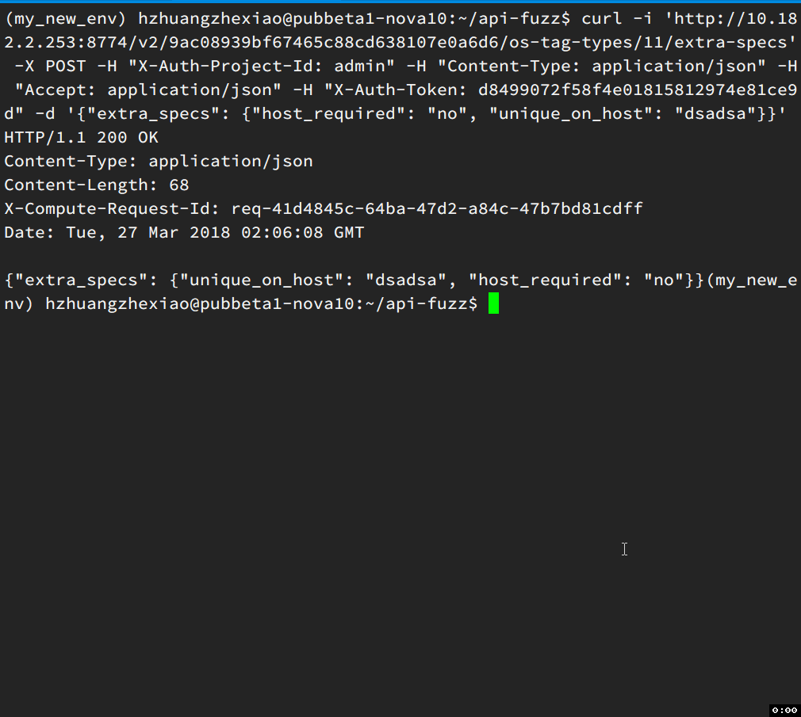
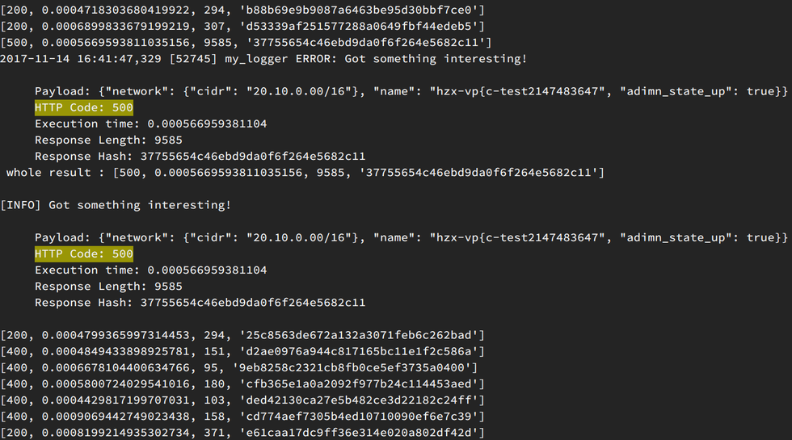
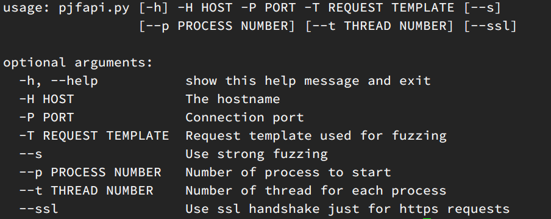
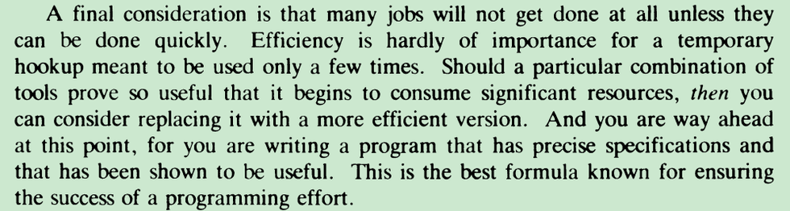

# apiFuzz

Python JSON API Fuzzer based on PyJFuzz, PyJFAPI and uncurl

## Installation

```
pip install PyJFuzz

git clone git@github.com:smasterfree/api-fuzz.git
```

## How to use



press ctrl+c to stop the script.

---

 

#  api 接口 fuzz 测试初探  

## 目标

在日常测试工作中，经常会有api接口的测试，除了正向流程的测试之外，我们经常还需要覆盖一些异常情况。

例如：

- 不合法字符串
- 字符串超长
- 应该是数字类型的，传入了字母
- 参数为空
- 传入了中文，标点符号等
- sql注入等等

事实上，我们组的接口测试demo框架中，在dataprovider中也经常能够看到诸如下面的例子。

```
@DataProvider(name = "testIllegalName")
	public static Object[][] testIllegalName(){

    return new Object[][]{
            
            //name 
            {null, 400, "域名为空或者域名非法"},
            {"", 400, "域名为空或者域名非法"},
            {"abcdefghijilmnopqrstu", 400, "域名为空或者域名非法"},
            {" ", 400, "域名为空或者域名非法"},
            {"12", 400, "域名为空或者域名非法"},
            {"-12", 400, "域名为空或者域名非法"},
            {"0.2", 400, "域名为空或者域名非法"},
            {"abcdefghij0123456789abcdefghij0123456789abcdefghij0123456789abcd.com", 400, "域名为空或者域名非法"},
            {"zxq.qa.com", 400, "域名为空或者域名非法"},
            {"zxq_qa.com", 400, "域名为空或者域名非法"},

							
		};
	}
```

此处是看看接口在传入非期望值的时候，能不能够很好的处理类似请求。

除此以外，还有一些和业务场景强相关的值类型，比如网络测试的时候，我们会关心cidr的格式；计费测试的时候，又特别关注数字的类型。

一方面，给每个接口增加类似的异常接口测试相对比较无趣；另一方面，我们作为人，考虑问题，不管是开发还是测试，都难免挂一漏万，有一些边边角角的case没能考虑到。

既然如此，我们能否统一抽象出来一种接口异常测试的框架，**自动** 注入各种类型的异常，然后将凡是服务没有捕获的，抛出trace, exception 的，记录下请求的payload，为后续验证覆盖提供支撑。

## 原理


主要使用了模糊测试技术（fuzz testing, fuzzing）。其核心思想是自动或半自动的生成随机数据输入到一个程序中，并监视程序异常，如崩溃，断言(assertion)失败，以发现可能的程序错误，比如内存泄漏。（摘抄之维基百科）

简单的模糊测试随机输入数据，而更加高效的模糊测试，需要理解对象结构或者协议。通过向数据内容，结构，消息，序列中引入一些异常，来人为的构造聪明的模糊测试。


如果你持续关注文件系统或内核技术，你一定注意过这样一篇文章：Fuzzing filesystem with AFL。Vegard Nossum 和 Quentin Casasnovas 在 2016 年将用户态的 Fuzzing 工具 AFL（American Fuzzing Lop）迁移到内核态，并针对文件系统进行了测试。

结果是相当惊人的。Btrfs，作为 SLES（SUSE Linux Enterprise Server）的默认文件系统，仅在测试中坚持了 5 秒钟就挂了。而 ext4 坚持时间最长，但也仅有 2 个小时而已。(https://zhuanlan.zhihu.com/p/28828826)

所以基于此，在api接口测试中引入模糊测试理论上也是可行的，而且是有效的。

## 举例

经过一番调研和搜索之后，发现了以下这个项目在接口fuzz测试中，有比较好的上手体验。

```
pip install PyJFuzz
git clone https://github.com/dzonerzy/PyJFAPI.git
```

我对 PyJFAPI 稍微进行了一些修改，包括日志记录，以及异常判断的地方，只记录服务器返回500错误的情况等。

首先需要准本一个请求的模板。

```
cat request.text

POST /v2.0/networks.json HTTP/1.1
Host: pubbeta1-iaas.service.163.org
X-Auth-Token: 6645b224a8314d0c89e09a011cbddf53
Content-Type: application/json
Accept: application/json


***{"network": {"cidr": "20.100.0.0/16", "name": "hzx-vpc-test1", "admin_state_up": true}}***
```

这里是一个 post请求，定义了一些请求头和请求体。星号之间的请求json体，为异常注入点。
它会自动分析你的json格式，生成各种 payload。理论上来说，你只需要给它提供一份接口的scheme就行(要是所有接口都可以从Swagger直接导出那就很方便了)。


运行：

```
python pjfapi.py -H pubbeta1-iaas.service.163.org  -P 9797  -T request.txt 
```

返回 

  

我们可以手工请求一下这些导致异常的payload。
实例1：

```
(hzx_env) hzhuangzhexiao@pubbeta1-nova10:~$ curl -i http://pubbeta1-iaas.service.163.org:9797/v2.0/networks.json -X POST -H "X-Auth-Token: 7d52816088e84e5392019ed00c2f386f" -H "Content-Type: application/json" -H "Accept: application/json" -H "User-Agent: python-protonclient" -d '{"network": {"cidr": "20.010.0.0/16", "name": "hzx-vpc-test1", "admin_state_up": true}}'
HTTP/1.1 500 
Content-Type: application/json;charset=ISO-8859-1
Content-Length: 9586
Date: Tue, 14 Nov 2017 05:59:42 GMT
Connection: close

An unknown exception occurred.
java.lang.IllegalArgumentException: '20.010.0.0' is not an IP string literal.
	at com.google.common.net.InetAddresses.formatIllegalArgumentException(InetAddresses.java:1035)
	at com.google.common.net.InetAddresses.forString(InetAddresses.java:154)
	at com.netease.cns.proton.server.utils.HelperUtils.convertIpStringToInt(HelperUtils.java:107)
	at com.netease.cns.proton.server.utils.HelperUtils.getIp4NetworkProtoBuf(HelperUtils.java:189)
	at com.netease.cns.proton.server.utils.HelperUtils.getIp4NetworkProtoBuf(HelperUtils.java:194)
```

事实上，我们本来已经对这个cidr参数进行了一些异常值的测试。包括：

```
"cidr": "20.256.0.0/16"    不规范的类型
"cidr": "20.ssss.0.0/16"  部分为字符串
"cidr": "ssssss"   全为字符串
"cidr": ""          为空
```

等等。可以发现，还是有部分特殊情形没有考虑到。

实例2

```
(hzx_env) hzhuangzhexiao@pubbeta1-nova10:~$ curl -i http://pubbeta1-iaas.service.163.org:9797/v2.0/security-group-rules.json -X POST -H "X-Auth-Token: af75ed821eeb4d5c9e88fb4ba804ff48" -H "Content-Type: application/json" -H "Accept: application/json" -H "User-Agent: python-protonclient" -d '{"security_group_rule": {"direction": "ingress", "protocol": "tcp", "ethertype": "IPv4", "port_range_max": "6660", "security_group_id": "48b9cc1e-53f8-4f7e-8983-bffb209153f3", "port_range_min": "80", "remote_ip_prefix": "0.0.0.0/"}}'
HTTP/1.1 500 
Content-Type: application/json;charset=ISO-8859-1
Content-Length: 6310
Date: Tue, 14 Nov 2017 05:59:10 GMT
Connection: close

An unknown exception occurred.
java.lang.ArrayIndexOutOfBoundsException: 1
	at com.netease.cns.proton.server.service.SecurityGroupServiceImpl.validateIpPrefix(SecurityGroupServiceImpl.java:385)
	at com.netease.cns.proton.server.service.SecurityGroupServiceImpl.createSecurityGroupRule(SecurityGroupServiceImpl.java:228)
	at sun.reflect.GeneratedMethodAccessor385.invoke(Unknown Source)
	at sun.reflect.DelegatingMethodAccessorImpl.invoke(DelegatingMethodAccessorImpl.java:43)
	at java.lang.reflect.Method.invoke(Method.java:498)

```

我把程序构造的部分异常打印出来，可以看到类型还是很丰富的。

```
{"network": {"cidr": "20.100.0.0/16", "name": "hzx-vpc-test1D, "admin_state_up"_ true}}
{"network": {"cidr": "20.100.0.0/16", "name": "hzx-vpc-test-1", "admin_state_up": true}}
{"network": {"cidr": "20.100.0.0/16", "name": "hzx-vpc-test1", "admin_state_up": true}}
{"network": {"cidr": "20.100.0.0/16", "name": "hzx-vpc-test1", "admin_state_utrue}}
{"network-": {"cidr": "20.100.0.0/16", "name": "hzx-vpc-test1", "admin_state_uuuuuuuuuuuuuuuuuuuuuuuuuuuuuuuuuuuuuuuuuuuuuuuuuuuuuuuuuuuuuuuup": true}}
{"network": {"cidr": "20.1.0/16", "name": "hzx-vpc-test1", "admin_state_up": true}}
{"network": {"cidr": "20.100.0.0/16", "name": "hzx-vpc-test1", : tru}e}
{"network": {"cidr": "20.100.0.0/16", "name": "hzx-vp¸-test1", "admin_state_up": true}}
{"network": {"cidr": "20.100.0.0/16", "name": "hzx-vpc-test1"ՠ: true}}
{"network": {"cdr": "20100..0.0/16", "name": "hzx-vpc-test1", "admin_state_up": true}}
{"network": {"cidr": "20.100.0.0/16", "name": "hzx-vpc-test1", "admin_stap"::: true}}
{"network": {"cidr": "20.100.0.0/16", "name": hzx-vpc-test1", "admin_state_up": true}}
"network": {"cidr": "20.100.0.0/16", "name": "hzx-vpc-test1", "admin_state_up": true}}
{"network": {"cidr": "20.100.0.0/16", "name": "hzx-vpc-test1", "admin_state_up":} true}}
{"neeeeeeeeeeeeeeeeeeeeeeeeeeeeeetwork": {"cidr": "20.100.0.0/16", "name": "hzx-vpc-test1", "admin_state_up""admin_state_up""admin_state_up""admin_state_up""admin_state_up""admin_state_up""admin_s,ate_up""admin_state_up""admin_state_up": true}}
{"network": }
"n{et���: r{"cidr": "0.}0.0/-34359738368", "naD: true}}
{"network": }
{"[network": {"cidr": "20.-214748364800.0.0/16", "name": "hzx-vpc-test1", "admin_state_up": true}}
{"network": {"cidr": "20.100.0.0/16", "name": "hzx-vpc-test1", "admin_state_up": true}{"cidr": "20.100.0.0/16", "name": "hzx-vpc-test1", "admin_state_up": true}{"cidr": "20.100.0.0/16", "name": "hzx-vpc-test1", "admin_state_up": true}}
{"network": {"cidr": "20.1000.0/+.16", "name": "hzx-vpc-test1", "admin_state_up": true}}
{"network": {"cidr": "20.100.0.0/16", "name": "hzx-vpc-test1", "admin_state_up""admin_state_up""admin_state_up": true}}
{"networ[k": {"cidr": "20.100.0.0/16", "name": "hzx-vpc-test1", "admin_state_up": true}}
{"network": {"cidr": "20.100.0.0/-4080", "name": "hzx-vpc-test1", "admin_state_up": true}}
{"network": {"cidr": "20.100.0.0/-4080", "name": "hzx-vpc-test1", "admin_state_up": true}}
{"network": {"cidr": "20.-25500.0.0/16", "name": "hzx-vpc-test1", "admin_stateeeeeeeeeeeeeeeeeeeee_up": true}}
```


pjfapi.py 脚本本身使用方法很简单。 -h 看下help为命令行参数的基本说明。


  

## 结论

本文简要的介绍了fuzz测试技术，以及将其应用到api接口测试中的实现，给出了一个具体的fuzz接口测试例子。它不一定能够完全替代掉人工的接口异常，但是可以作为一个很好的补充。

---

# 15秒接口模糊测试指南

## 哲学
在《api 接口 fuzz 测试初探》，简单介绍了一个接口模糊测试工具。好用是好用，就是需要写出接口的schema：

```
POST /v2.0/networks.json HTTP/1.1
Host: pubbeta1-iaas.service.163.org
X-Auth-Token: 6645b224a8314d0c89e09a011cbddf53
Content-Type: application/json
Accept: application/json

***{"network": {"cidr": "20.100.0.0/16", "name": "hzx-vpc-test1", "admin_state_up": true}}***
```


然后按照如下的方式调用：

```
python pjfapi.py -H pubbeta1-iaas.service.163.org -P 9797 -T request.txt
```

要是有很多接口需要测试的话，显得很不方便。

我边上的一个同学看了之后，就曾这样说道：

> 我就想它自己给我测，都不用写schema。   


  

在 Software Tools 上面曾经有过这么一句话，xuyou也曾经在[这里](https://blog.youxu.info/2008/12/04/wikiwik/)引用过：很多事情, 只有在人能很快的完成的时候，才有了做的可能。这句话可能比较拗口，反过来说可能更加好懂：如果用某种方法做一件事情太耗时间了， 那么人就不可能用这个方法做事情。只有一个方法能够让人足够快的做好事情的时候，这个方法才会变得实用，同时这个事情才有做的可能性。

我在之前的一篇[文章](http://ks.netease.com/blog?id=5071)中提到过 gun parallel这个工具。


>很多接口在并发操作下会出现一些bug，比如有一些判断数据库里面没有加锁，是在代码层面判断的，结果并发请求下去，每个请求在到达服务器的时候是判断通过，一起写了之后就超出限制了。但是你要真正测并发的话，又要写脚本，或者利用python的mulitiprocessing封装一下。但我手边有了parallel，又在bashrc里面就加了以下两个alias
>
>``` alias p='parallel'  ```
>
>这样制造并发太方便了，只需要管道后面加个p , 我就时时刻刻可以制造并发来观察响应。
>
>举个例子
>
>``` seq 50 | p -n0 -q  curl 'example.com' ```

因为很方便，所以经常能够在命令行下制造并发，发现了不少问题！


## 实现

如此一来，那么就改造一下接口模糊测试工具哈。

最简单的方法就是传入一个curl，然后自动给你进行模糊注入。

curl请求是最容易得到的，比如chrome，postman里面可以自动导出，openstack client加上 `--debug`参数可以直接得到等等。

  

于是我稍微改造了一下，自动根据curl请求构建出pjfapi 的schema。

使用方法，把curl请求粘贴到request.txt中。
然后执行

```
python fuzz_curl.py request.txt
```

执行效果如下：

```
(my_new_env) hzhuangzhexiao@pubbeta1-nova10:~/api-fuzz$ python fuzz_curl.py request.txt 
[INFO] 
                 _   ______             
     /\         (_) |  ____|            
    /  \   _ __  _  | |__ _   _ ________
   / /\ \ | '_ \| | |  __| | | |_  /_  /
  / ____ \| |_) | | | |  | |_| |/ / / / 
 /_/    \_\ .__/|_| |_|   \__,_/___/___|
          | |                           
          |_|                           
    
[INFO] Starting api Fuzz...
[INFO] Start fuzzing in a few seconds...
[INFO] Performing 5 requests to 10.182.2.253
[INFO] Average statistics:

   HTTP Code: ['200']
   Time: 0.0014
   Length: 34
   Hash: ['d8e71bf22b715ade49030e45ee661c1d']

[400, 0.002610921859741211, 66, '110ef21d725c0242cb1c5b913f15137b']
[400, 0.0028450489044189453, 66, '110ef21d725c0242cb1c5b913f15137b']
[400, 0.0028600692749023438, 141, '3391da2f8a7bc52d2d38fe1810a3370d']
[200, 0.002708911895751953, 68, 'd8e71bf22b715ade49030e45ee661c1d']
[500, 0.002846956253051758, 128, 'cb78997cdbb65ad20fe58356baaeadb7']
2018-03-26 16:53:24,466 [90991] my_logger ERROR: Got something interesting!

     Payload: {"extra_specs": {"unique_on_host": "dsadsa", "host˲equired": "no"}}
     HTTP Code: 500
     Execution time: 0.00284695625305
     Response Length: 128
     Response Hash: cb78997cdbb65ad20fe58356baaeadb7
 whole result : [500, 0.002846956253051758, 128, 'cb78997cdbb65ad20fe58356baaeadb7'] 

```


需要关注 500 错误的 Payload即可。

目前还是处于初期poc阶段，只支持post json类型的请求注入。uncurl的解析也不完善。希望日后有时间慢慢完善。

试用请戳： https://github.com/smasterfree/api-fuzz

欢迎star！！