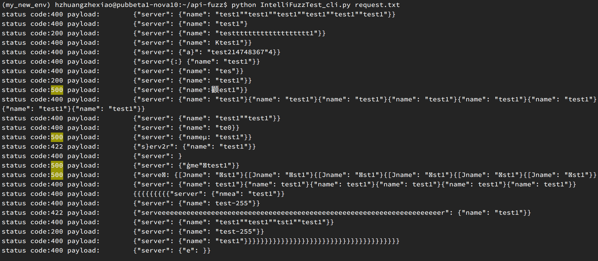
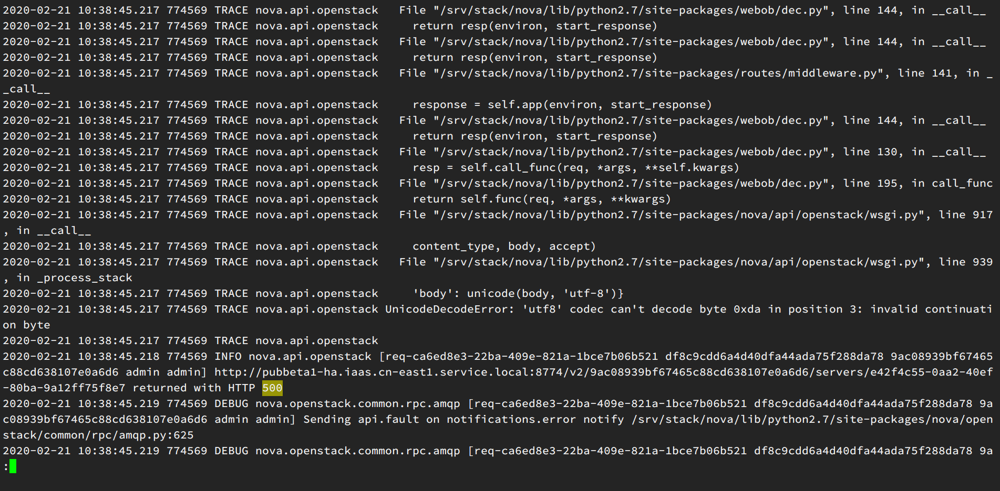
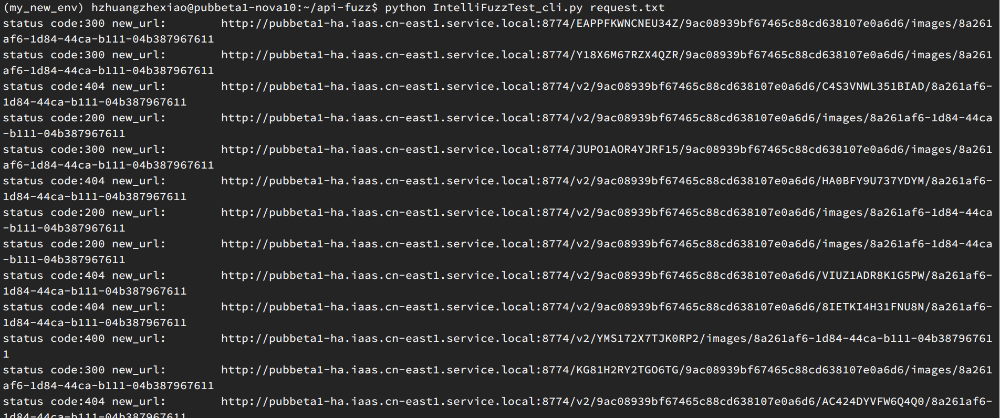

# IntelliFuzzTest cli 测试工具

## 安装

```
git clone ssh://git@g.hz.netease.com:22222/CloudQA/api-fuzz.git
pip install -r requirements.txt
```

## 快速开始

将curl 请求体放进  request.txt 文件中，执行命令

```
python IntelliFuzzTest_cli.py request.txt
```

## 特点

1. 支持请求body体变异
2. 支持请求url path 变异
3. 随机增删请求header
4. 支持post/get/delete/put方法
5. 可以直接根据curl命令进行变异

## 背景

在日常测试工作中，经常会有api接口的测试，除了正向流程的测试之外，我们经常还需要覆盖一些异常情况。

例如：

- 不合法字符串
- 字符串超长
- 应该是数字类型的，传入了字母
- 参数为空
- 传入了中文，标点符号等
- sql注入等等

事实上，我们组的接口测试demo框架中，在dataprovider中也经常能够看到诸如下面的例子。

```
@DataProvider(name = "testIllegalName")
	public static Object[][] testIllegalName(){

    return new Object[][]{
            
            //name 
            {null, 400, "域名为空或者域名非法"},
            {"", 400, "域名为空或者域名非法"},
            {"abcdefghijilmnopqrstu", 400, "域名为空或者域名非法"},
            {" ", 400, "域名为空或者域名非法"},
            {"12", 400, "域名为空或者域名非法"},
            {"-12", 400, "域名为空或者域名非法"},
            {"0.2", 400, "域名为空或者域名非法"},
            {"abcdefghij0123456789abcdefghij0123456789abcdefghij0123456789abcd.com", 400, "域名为空或者域名非法"},
            {"zxq.qa.com", 400, "域名为空或者域名非法"},
            {"zxq_qa.com", 400, "域名为空或者域名非法"},

							
		};
	}
```

此处是看看接口在传入非期望值的时候，能不能够很好的处理类似请求。

除此以外，还有一些和业务场景强相关的值类型，比如网络测试的时候，我们会关心cidr的格式；计费测试的时候，又特别关注数字的类型。

一方面，给每个接口增加类似的异常接口测试相对比较无趣；另一方面，我们作为人，考虑问题，不管是开发还是测试，都难免挂一漏万，有一些边边角角的case没能考虑到。

既然如此，我们能否统一抽象出来一种接口异常测试的框架，**自动** 注入各种类型的异常，然后将凡是服务没有捕获的，抛出trace, exception 的，记录下请求的payload，为后续验证覆盖提供支撑。

## 原理


主要使用了模糊测试技术（fuzz testing, fuzzing）。其核心思想是自动或半自动的生成随机数据输入到一个程序中，并监视程序异常，如崩溃，断言(assertion)失败，以发现可能的程序错误，比如内存泄漏。（摘抄之维基百科）

简单的模糊测试随机输入数据，而更加高效的模糊测试，需要理解对象结构或者协议。通过向数据内容，结构，消息，序列中引入一些异常，来人为的构造聪明的模糊测试。


如果你持续关注文件系统或内核技术，你一定注意过这样一篇文章：Fuzzing filesystem with AFL。Vegard Nossum 和 Quentin Casasnovas 在 2016 年将用户态的 Fuzzing 工具 AFL（American Fuzzing Lop）迁移到内核态，并针对文件系统进行了测试。

结果是相当惊人的。Btrfs，作为 SLES（SUSE Linux Enterprise Server）的默认文件系统，仅在测试中坚持了 5 秒钟就挂了。而 ext4 坚持时间最长，但也仅有 2 个小时而已。(https://zhuanlan.zhihu.com/p/28828826)

所以基于此，在api接口测试中引入模糊测试理论上也是可行的，而且是有效的。

## demo

目前 IntelliFuzzTest  工具支持get/post /put/delete等类型的请求响应。

例如更新云主机接口

```
curl  'http://pubbeta1-ha.iaas.cn-east1.service.local:8774/v2/9ac08939bf67465c88cd638107e0a6d6/servers/e42f4c55-0aa2-40ef-80ba-9a12ff75f8e7' -X PUT -H "X-Auth-Project-Id: admin" -H "User-Agent: python-novaclient" -H "Content-Type: application/json" -H "Accept: application/json" -H "X-Auth-Token: c8e48bd22b0346539276c407e1ce1b47" -d '{"server": {"name": "test1"}}'
```

将curl请求放入request.txt中。执行模糊测试



我们即可以看到一些服务端异常产生。

我们看一眼服务端日志



即可以看到是因为默写编码异常导致的错误。

body体的json变异类型还是很丰富的。举例来说：

```
(hzx_env) hzhuangzhexiao@pubbeta1-nova10:~$ curl -i http://pubbeta1-iaas.service.163.org:9797/v2.0/security-group-rules.json -X POST -H "X-Auth-Token: af75ed821eeb4d5c9e88fb4ba804ff48" -H "Content-Type: application/json" -H "Accept: application/json" -H "User-Agent: python-protonclient" -d '{"security_group_rule": {"direction": "ingress", "protocol": "tcp", "ethertype": "IPv4", "port_range_max": "6660", "security_group_id": "48b9cc1e-53f8-4f7e-8983-bffb209153f3", "port_range_min": "80", "remote_ip_prefix": "0.0.0.0/"}}'
HTTP/1.1 500 
Content-Type: application/json;charset=ISO-8859-1
Content-Length: 6310
Date: Tue, 14 Nov 2017 05:59:10 GMT
Connection: close

An unknown exception occurred.
java.lang.ArrayIndexOutOfBoundsException: 1
	at com.netease.cns.proton.server.service.SecurityGroupServiceImpl.validateIpPrefix(SecurityGroupServiceImpl.java:385)
	at com.netease.cns.proton.server.service.SecurityGroupServiceImpl.createSecurityGroupRule(SecurityGroupServiceImpl.java:228)
	at sun.reflect.GeneratedMethodAccessor385.invoke(Unknown Source)
	at sun.reflect.DelegatingMethodAccessorImpl.invoke(DelegatingMethodAccessorImpl.java:43)
	at java.lang.reflect.Method.invoke(Method.java:498)

```

打印出变异的body体：
```
{"network": {"cidr": "20.100.0.0/16", "name": "hzx-vpc-test1D, "admin_state_up"_ true}}
{"network": {"cidr": "20.100.0.0/16", "name": "hzx-vpc-test-1", "admin_state_up": true}}
{"network": {"cidr": "20.100.0.0/16", "name": "hzx-vpc-test1", "admin_state_up": true}}
{"network": {"cidr": "20.100.0.0/16", "name": "hzx-vpc-test1", "admin_state_utrue}}
{"network-": {"cidr": "20.100.0.0/16", "name": "hzx-vpc-test1", "admin_state_uuuuuuuuuuuuuuuuuuuuuuuuuuuuuuuuuuuuuuuuuuuuuuuuuuuuuuuuuuuuuuuup": true}}
{"network": {"cidr": "20.1.0/16", "name": "hzx-vpc-test1", "admin_state_up": true}}
{"network": {"cidr": "20.100.0.0/16", "name": "hzx-vpc-test1", : tru}e}
{"network": {"cidr": "20.100.0.0/16", "name": "hzx-vp¸-test1", "admin_state_up": true}}
{"network": {"cidr": "20.100.0.0/16", "name": "hzx-vpc-test1"ՠ: true}}
{"network": {"cdr": "20100..0.0/16", "name": "hzx-vpc-test1", "admin_state_up": true}}
{"network": {"cidr": "20.100.0.0/16", "name": "hzx-vpc-test1", "admin_stap"::: true}}
{"network": {"cidr": "20.100.0.0/16", "name": hzx-vpc-test1", "admin_state_up": true}}
"network": {"cidr": "20.100.0.0/16", "name": "hzx-vpc-test1", "admin_state_up": true}}
{"network": {"cidr": "20.100.0.0/16", "name": "hzx-vpc-test1", "admin_state_up":} true}}
{"neeeeeeeeeeeeeeeeeeeeeeeeeeeeeetwork": {"cidr": "20.100.0.0/16", "name": "hzx-vpc-test1", "admin_state_up""admin_state_up""admin_state_up""admin_state_up""admin_state_up""admin_state_up""admin_s,ate_up""admin_state_up""admin_state_up": true}}
{"network": }
"n{et���: r{"cidr": "0.}0.0/-34359738368", "naD: true}}
{"network": }
{"[network": {"cidr": "20.-214748364800.0.0/16", "name": "hzx-vpc-test1", "admin_state_up": true}}
{"network": {"cidr": "20.100.0.0/16", "name": "hzx-vpc-test1", "admin_state_up": true}{"cidr": "20.100.0.0/16", "name": "hzx-vpc-test1", "admin_state_up": true}{"cidr": "20.100.0.0/16", "name": "hzx-vpc-test1", "admin_state_up": true}}
{"network": {"cidr": "20.1000.0/+.16", "name": "hzx-vpc-test1", "admin_state_up": true}}
{"network": {"cidr": "20.100.0.0/16", "name": "hzx-vpc-test1", "admin_state_up""admin_state_up""admin_state_up": true}}
{"networ[k": {"cidr": "20.100.0.0/16", "name": "hzx-vpc-test1", "admin_state_up": true}}
{"network": {"cidr": "20.100.0.0/-4080", "name": "hzx-vpc-test1", "admin_state_up": true}}
{"network": {"cidr": "20.100.0.0/-4080", "name": "hzx-vpc-test1", "admin_state_up": true}}
{"network": {"cidr": "20.-25500.0.0/16", "name": "hzx-vpc-test1", "admin_stateeeeeeeeeeeeeeeeeeeee_up": true}}
```

get类型请求可以对url path进行模糊注入。



另外，还支持对请求的header进行随机增删，模拟请求等。